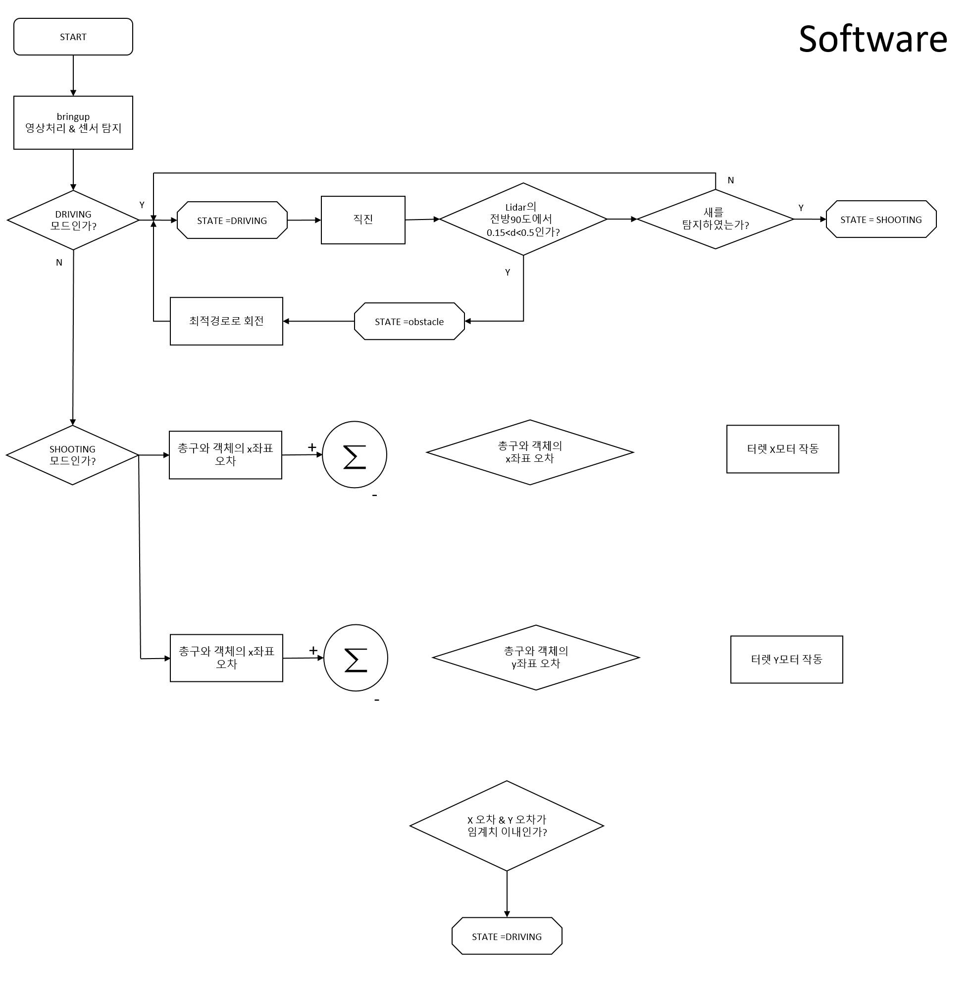
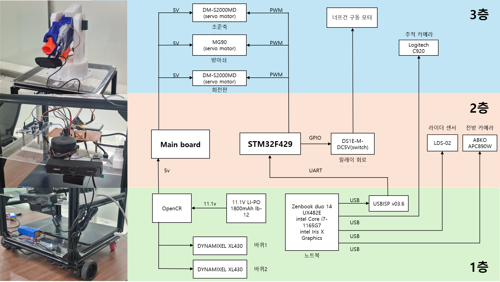
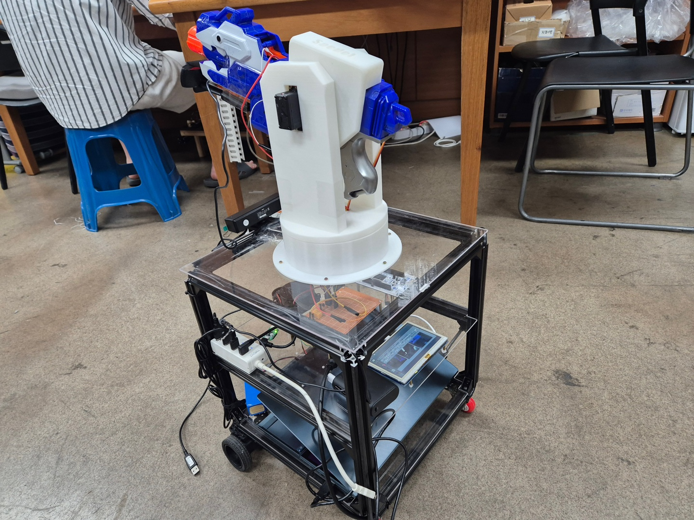
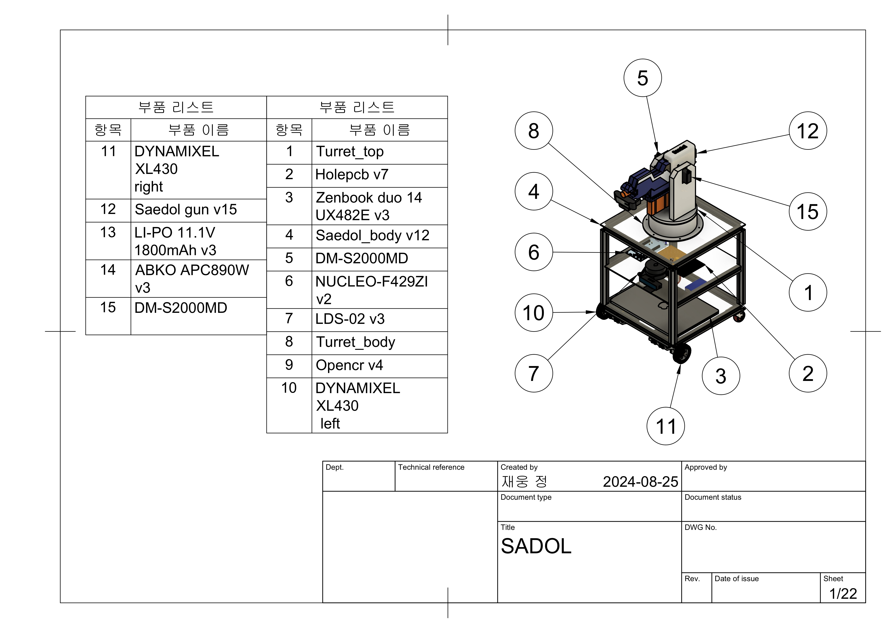
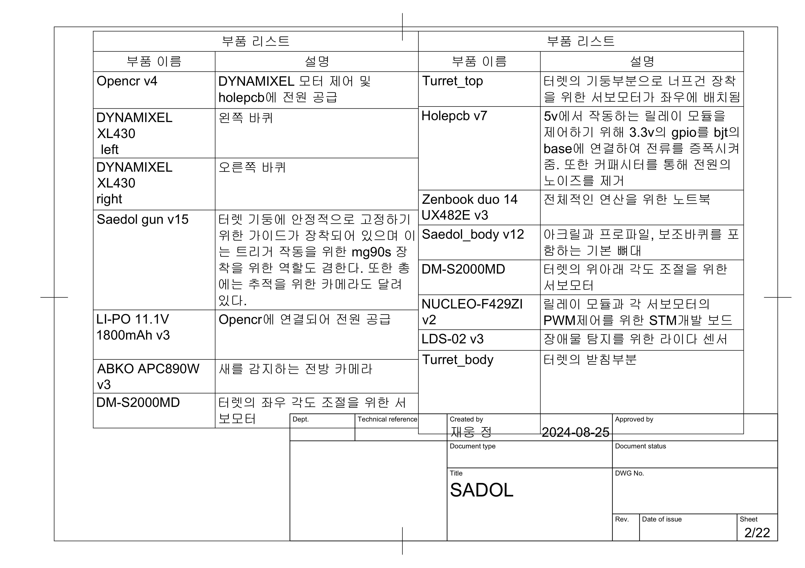
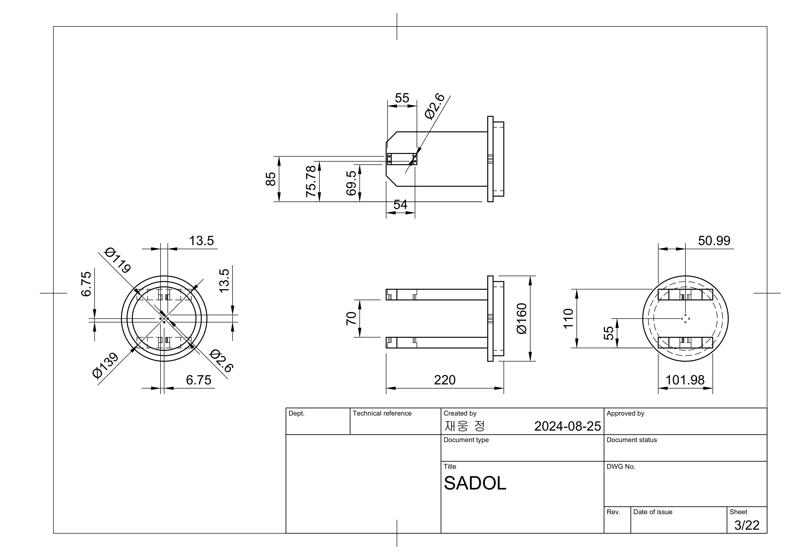
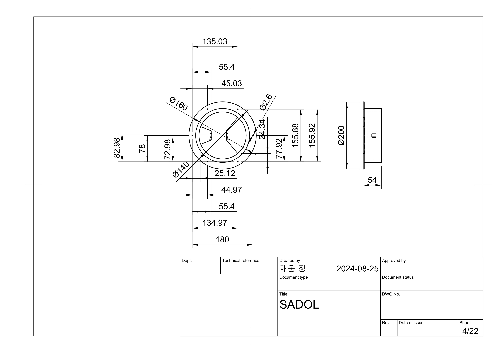
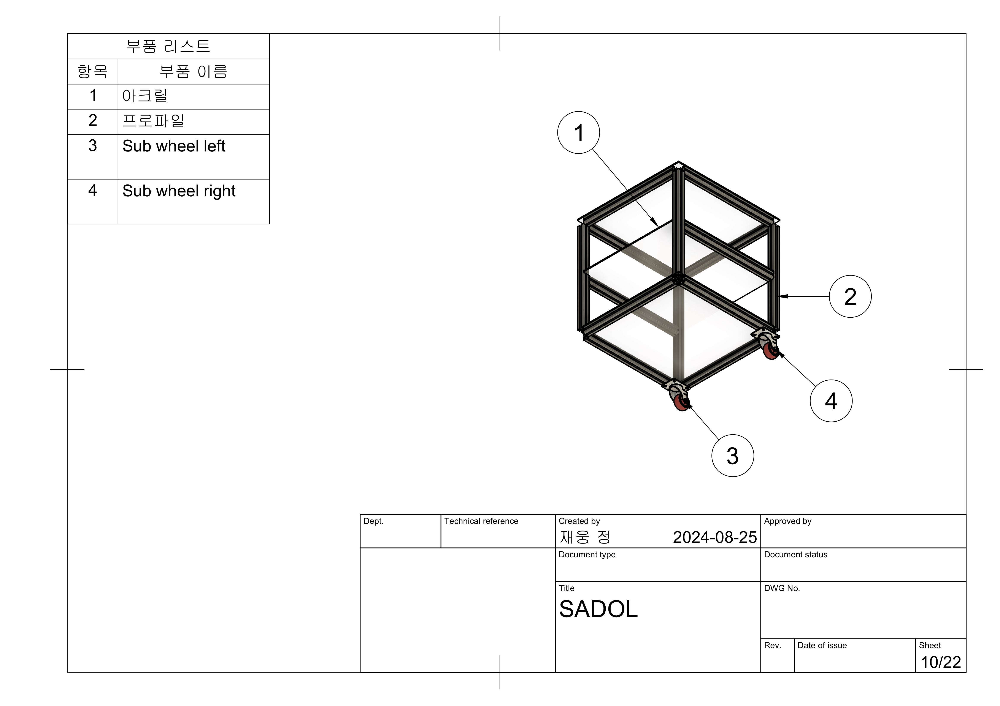

# bitdol_2024_SAEDOL
2024년 경북대학교 동아리 빛돌에서 진행한 프로젝트입니다.
## 프로젝트 설명
공항의 활주로에서 운항 중인 항공기나 전투기에 조류가 충돌하여 생기는 항공사고를 '버드 스트라이크'라고 합니다. 버드 스트라이크는 최근 5년간 약 500건이 발생할 정도로 빈번하게 발생하는 심각한 항공사고입니다. 이러한 사고는 항공기의 안전에 큰 위협이 될 뿐만 아니라, 수리와 지연으로 인해 막대한 비용이 발생할 수 있습니다.

본 프로젝트의 목표는 이러한 버드 스트라이크를 효과적으로 예방하기 위한 자율주행 터렛 시스템을 개발하는 것입니다. 이 터렛은 활주로 주변에서 실시간으로 새의 위치를 탐지하고, 자동으로 조류를 쫓아내는 역할을 합니다. 터렛은 정밀한 센서와 인공지능 알고리즘을 통해 새를 식별하고, 비례적인 대응을 하여 조류가 항공기와의 충돌을 피할 수 있도록 유도합니다.

이 시스템은 기존의 수동적이고 비효율적인 조류 퇴치 방법들을 대체할 수 있으며, 활주로에서의 버드 스트라이크를 크게 줄여 공항의 안전성을 향상시키는 데 기여할 것입니다. 나아가, 이 기술은 다양한 환경에서도 활용될 수 있는 잠재력을 가지고 있으며, 미래의 자율화된 공항 운영에 중요한 역할을 할 것입니다. 


## 주요 구성도
### Software 알고리즘 순서도

***
### Hardware 구성도


### 최종 모델링

***
.jpg)
***
<div style="display: flex; justify-content: space-between;">
  
  
</div>


***
## 실행 방법
```sh
cd ~/catkin_ws
catkin_make
roslaunch launch bird_alert_setup.launch
roslaunch launch bird_alert_start.launch
```

## 실행 노드
#### **bird_alert_setup.launch**
 `turtlebot3_robot.launch`\
 `usb_cam.launch`\
 `bird_turret.launch` : `rasptostm.py`
#### **bird_turret_start.launch**
`bird_core.launch` : `core.py`, `lidar_processing_node.py`\
`bird_detectkin_1.launch` : `detection_1.py`\
`bird_detectkin_2.launch` : `detection_2.py`


## 실행 노드

***

***

## 전체 도면





