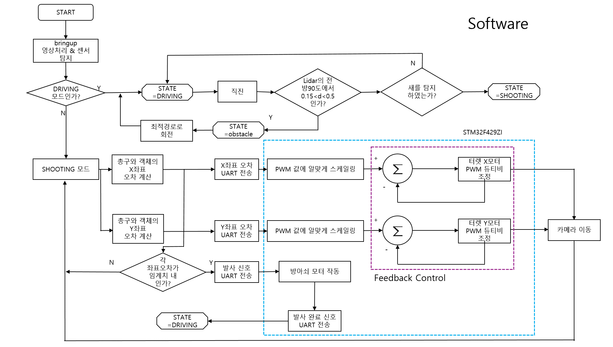

# bitdol_2024_SAEDOL
2024년 경북대학교 동아리 빛돌에서 진행한 프로젝트입니다.
## 프로젝트 설명
공항의 활주로에서 운항 중인 항공기나 전투기에 조류가 충돌하여 생기는 항공사고를 '버드 스트라이크'라고 합니다. 버드 스트라이크는 최근 5년간 약 500건이 발생할 정도로 빈번하게 발생하는 심각한 항공사고입니다. 이러한 사고는 항공기의 안전에 큰 위협이 될 뿐만 아니라, 수리와 지연으로 인해 막대한 비용이 발생할 수 있습니다.

본 프로젝트의 목표는 이러한 버드 스트라이크를 효과적으로 예방하기 위한 자율주행 터렛 시스템을 개발하는 것입니다. 이 터렛은 활주로 주변에서 실시간으로 새의 위치를 탐지하고, 자동으로 조류를 쫓아내는 역할을 합니다. 터렛은 정밀한 센서와 인공지능 알고리즘을 통해 새를 식별하고, 비례적인 대응을 하여 조류가 항공기와의 충돌을 피할 수 있도록 유도합니다.

이 시스템은 기존의 수동적이고 비효율적인 조류 퇴치 방법들을 대체할 수 있으며, 활주로에서의 버드 스트라이크를 크게 줄여 공항의 안전성을 향상시키는 데 기여할 것입니다. 나아가, 이 기술은 다양한 환경에서도 활용될 수 있는 잠재력을 가지고 있으며, 미래의 자율화된 공항 운영에 중요한 역할을 할 것입니다. 


## 주요 구성도
### Software 알고리즘 순서도

***
### Hardware 구성도


### 최종 모델링

***
.jpg)
***
<div style="display: flex; justify-content: space-between;">
  <div style="width: 48%;">
    <video controls>
      <source src="./image/작동영상.mp4" type="video/mp4">
      Your browser does not support the video tag.
    </video>
  </div>
  <div style="width: 48%;">
    <video controls>
      <source src="./image/작동영상2.mp4" type="video/mp4">
      Your browser does not support the video tag.
    </video>
  </div>
</div>

***
## 주요 구성도
```
catkin_ws/
├── src/
│   ├── bird_alert/
│   │   ├── bird_camera/
│   │   │   ├──bird_detection/
│   │   │   └──camera_launch/
│   │   ├── bird_turret/
│   │   └── bird_autodriving/
│   └── turtlebot3/
└── CMakeLists.txt
```

이런식으로 제가 지정해준 폴더 내에 여러 패키지를 만들어주시면 됩니다.

## 레포지토리 지정폴더
이 레포지토리에 지정된 폴더 내에 여러분들이 작성하신 패키지들을 저장해주시길 바랍니다.
- **규리**: `/bird_camera`
- **승헌 기웅**: `/bird_turret`
- **상훈 재웅**: `/bird_autodriving`

이 폴더 내부에 패키지를 넣어주시면 됩니다. 그런 후에 지정폴더를 공유해주시면 됩니다.

### 레포지토리 클론 및 워크스페이스 설정 방법

1. `catkin_ws/src` 디렉토리로 이동합니다.
   ```sh
   cd ~/catkin_ws/src
   ```

2. 레포지토리를 클론합니다.
   ```sh
   git clone <레포지토리 URL>
   ```

3. `catkin_ws` 디렉토리로 이동합니다.
   ```sh
   cd ~/catkin_ws
   ```

4. `catkin_ws` 디렉토리에서 catkin 워크스페이스를 빌드합니다. (새로운 패키지를 다운받으면 이를 실행시키기 위하여 빌드를 해주어야합니다.)
   ```sh
   catkin_make
   ```

5. 환경 설정을 적용합니다. (여러분의 PC에 이 명령어가 bashrc에 추가되어 있을 것이기 때문에 `source ~/.bashrc` 해주어도 됩니다.)
   ```sh
   source devel/setup.bash
   ```